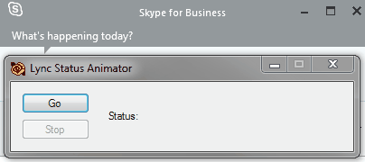

This is a desktop application written in C# using Windows Forms to animate the Lync/Skype for Business personal status note with some fun animations by setting a new status every second. It minimizes to the tray. The Lync 13 SDK is required to run this.

